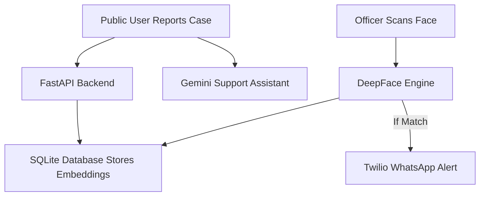

# 🚨 Nexo  
## AI-Powered Search & Visual Recovery System

> Accelerating missing person identification using AI facial recognition, real-time alerts, and intelligent assistance.

---

## 🌍 Problem Statement

Missing person investigations often suffer from:
- Delayed identification
- Manual verification processes
- Communication gaps between authorities and families
- Lack of centralized tracking

Every minute matters.

---

## 💡 Solution — Nexo

**Nexo** is an AI-driven missing person support platform that:

✔ Performs real-time facial recognition  
✔ Sends instant WhatsApp alerts to families  
✔ Provides AI-powered public assistance  
✔ Equips officers with a command analytics dashboard  

Nexo bridges the gap between reporting and recovery.

---

# ✨ Core Features

## 🔍 1. Live AI Facial Search
- Real-time webcam frame scanning
- DeepFace (ArcFace) powered recognition
- Cosine similarity matching
- Instant confidence score output

---

## 📲 2. Instant WhatsApp Alerts
- Integrated with Twilio WhatsApp API
- Automated notifications to complainants
- Triggered when match threshold is exceeded

---

## 🤖 3. Nexo Support Assistant
- Powered by Google Gemini API
- Provides:
  - Case updates
  - Reporting guidance
  - Public assistance instructions

---

## 📊 4. Officer Command Dashboard
- Secure login portal
- Live statistics and trends
- Chart.js-based visual analytics
- Facial scan interface
- Case management tools

---

## 📝 5. Structured Reporting Portal
- Standardized missing person registration
- Image upload & encoding
- Automatic embedding generation
- Secure storage in database

---

# 🧠 How It Works



---

# 🏗️ System Architecture

### 🔹 Reporting Flow
1. User submits missing person form
2. Image processed with DeepFace
3. Facial embeddings stored in SQLite

### 🔹 Identification Flow
1. Officer scans webcam frame
2. DeepFace generates new embeddings
3. Cosine similarity comparison performed
4. If similarity > threshold → WhatsApp alert triggered

---

# 🛠️ Tech Stack

## Backend
- FastAPI (Python)
- SQLite
- Uvicorn

## AI Engine
- DeepFace (ArcFace Model)
- TensorFlow
- OpenCV

## Frontend
- Jinja2 Templates
- Tailwind CSS
- Chart.js

## Communication
- Twilio WhatsApp Business API

## AI Assistant
- Google Gemini API

---

# 📦 Installation

## 1️⃣ Clone Repository
```bash
git clone https://github.com/your-username/nexo.git
cd nexo
```

## 2️⃣ Create Virtual Environment
```bash
python -m venv venv
source venv/bin/activate        # Mac/Linux
.\venv\Scripts\activate         # Windows
```

## 3️⃣ Install Dependencies
```bash
pip install -r requirements.txt
```

## 4️⃣ Configure Environment Variables

Create a `.env` file:

```env
TWILIO_ACCOUNT_SID=your_sid
TWILIO_AUTH_TOKEN=your_token
GOOGLE_API_KEY=your_gemini_key
SECRET_KEY=your_secret
```

---

# ▶️ Run Application

```bash
python run.py
```

Access at:

```
http://127.0.0.1:8001
```

---

# 📡 API Endpoints

| Endpoint | Method | Description |
|-----------|--------|-------------|
| `/` | GET | Landing Page |
| `/report` | GET/POST | Missing Person Registration |
| `/officer-login` | GET/POST | Officer Login |
| `/officer-dashboard` | GET | Officer Command Center |
| `/officer/scan-frame` | POST | DeepFace Recognition API |
| `/chat` | POST | Gemini Assistant Endpoint |

---

# 📸 Screenshots

| Landing Page | Officer Dashboard | AI Assistant |
|--------------|-------------------|--------------|
|  |  |  |

---

# 🔐 Security Measures

- Officer-only protected routes
- Environment variable protection
- Session-based authentication
- Controlled API endpoints

---

# 🚀 Future Enhancements

- PostgreSQL migration
- Cloud deployment (AWS/GCP)
- Multi-camera real-time monitoring
- Improved threshold calibration
- Government database integration

---

# 👥 Team Nexo

- Project Lead — Your Name  
- AI Engineer — Team Member  
- Backend Developer — Team Member  
- Frontend Developer — Team Member  

---

# 📄 License

MIT License

---

# 🏆 Impact

Nexo reduces:

⏱ Identification time  
📉 Communication delay  
📊 Manual processing errors  

By combining AI + automation + analytics,  
Nexo enables faster, smarter recovery.

---

**Nexo — Because every second matters.**
